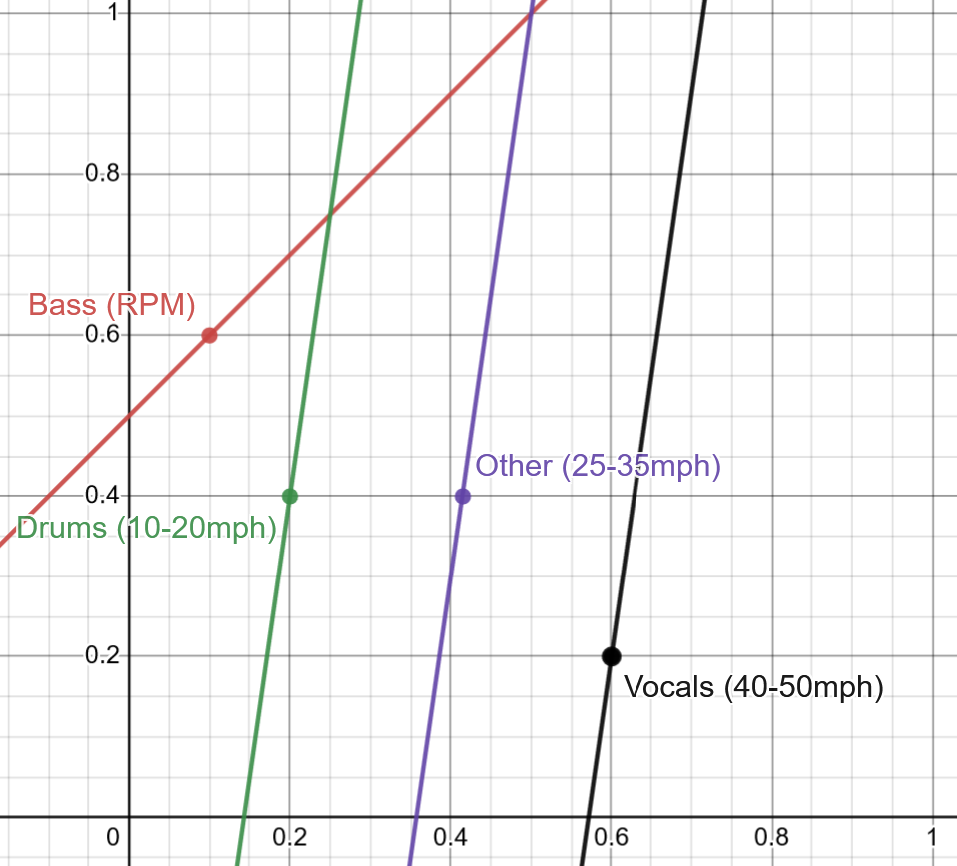

```
   ____                                       
  / ___|__ _ _ __ _ __ ___   ___  _ __  _   _ 
 | |   / _` | '__| '_ ` _ \ / _ \| '_ \| | | |
 | |__| (_| | |  | | | | | | (_) | | | | |_| |
  \____\__,_|_|  |_| |_| |_|\___/|_| |_|\__, |
                                        |___/
```

# Carmony
A work-in-progress open source version of Mercedes' MBUX Sound Drive

## Demo
<iframe width="560" height="315" src="https://www.youtube.com/embed/vxGZE5MImc0?si=0VFSEBzuAVR0KE2W" title="YouTube video player" frameborder="0" allow="accelerometer; autoplay; clipboard-write; encrypted-media; gyroscope; picture-in-picture; web-share" allowfullscreen></iframe>

## Credits
Music Files/Loops: [ModeAudio on YouTube](https://www.youtube.com/watch?v=8b_Mv0cUEsc)

Music Control: [PyGame](https://github.com/pygame/pygame)

OBD Reading: [Python-OBD](https://python-obd.readthedocs.io/en/latest/)

## Requirements

- [An ELM327 OBD Reader like this](https://www.amazon.co.uk/dp/B07MQ8GHG3?psc=1&ref=ppx_yo2ov_dt_b_product_details) (Not an affiliate link)
- [PyGame](https://github.com/pygame/pygame)
- [Python-OBD](https://python-obd.readthedocs.io/en/latest/)
- A car with an OBD2 port
- A laptop or Raspberry Pi

## How it Works
The aim for this repo is to enable a musical loop to be controlled using inputs from a car's OBD port, similarly to the effect of Mercedes' Sound Drive.

When the program is ran, six looped tracks will begin to run constantly. 

As adjustments are made to the car's current state (RPM, Speed, and Throttle), the volumes of each of the five loops will change. They change in accordance with this graph:



This chart shows volume of instrument on the Y axis, and percentage activation of the measured heuristic (Speed, RPM, or Accelerator Position) on the X axis.

Currently, it only works for one simple 30s synthwave loop, however with enough interest I may revisit this project to add more features. One possible feature would be the ability to add whatever looped sample the user wants. Even more ambitious would be to try and make this project work with any music, automatically separating the tracks from the song, and playing them at separate volumes automatically.

## Set Up

If you want to set this up for yourself, you will need to download the files listed in this repo onto a laptop or Raspberry Pi. Then, you will need an [ELM327 OBD2 reader like this](https://www.amazon.co.uk/dp/B07MQ8GHG3?psc=1&ref=ppx_yo2ov_dt_b_product_details).  

Simply connect the USB OBD2 reader to your computer's COM4 USB port (This will need to be adjusted manually if using a different port, Linux, or a wireless OBD reader). Then run the script. If all goes well, it should start to work after a few seconds.